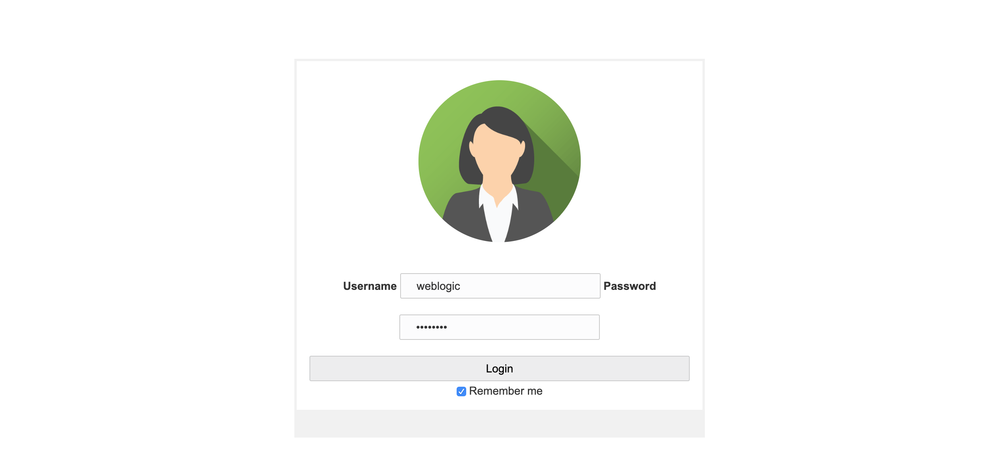
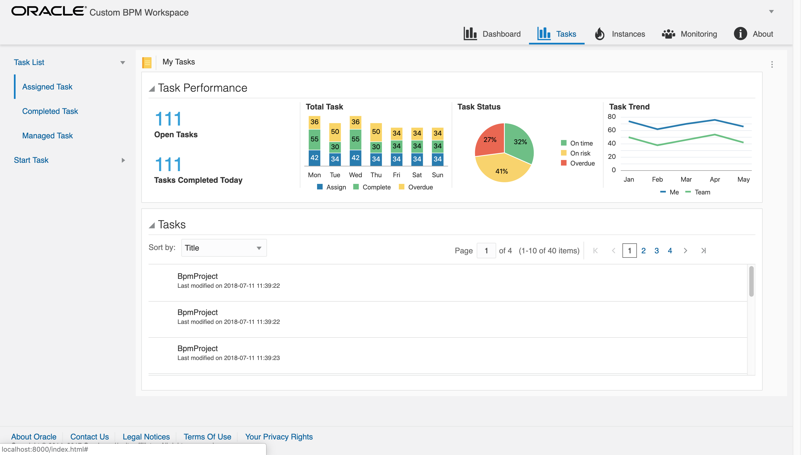
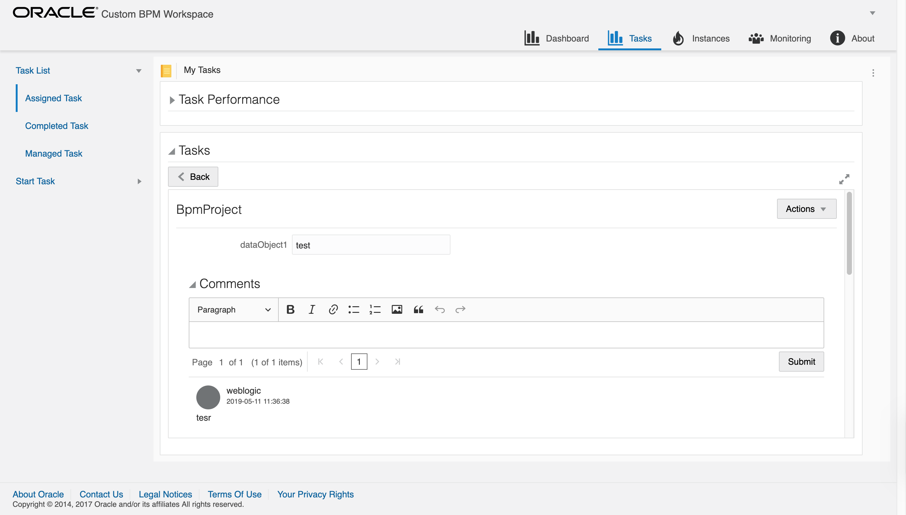
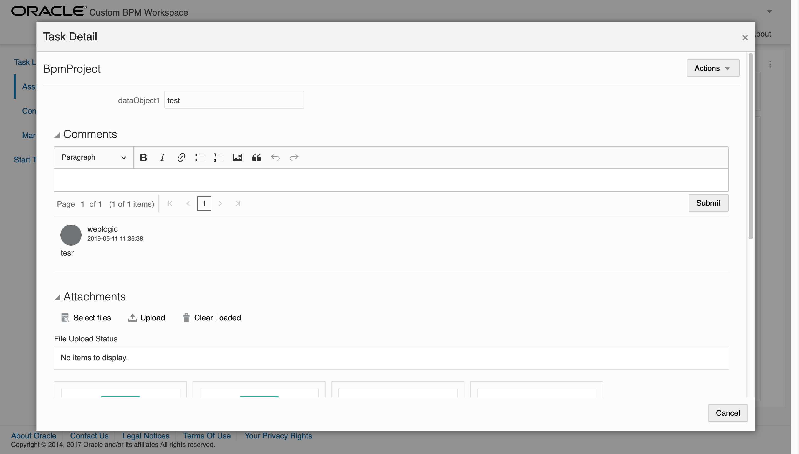
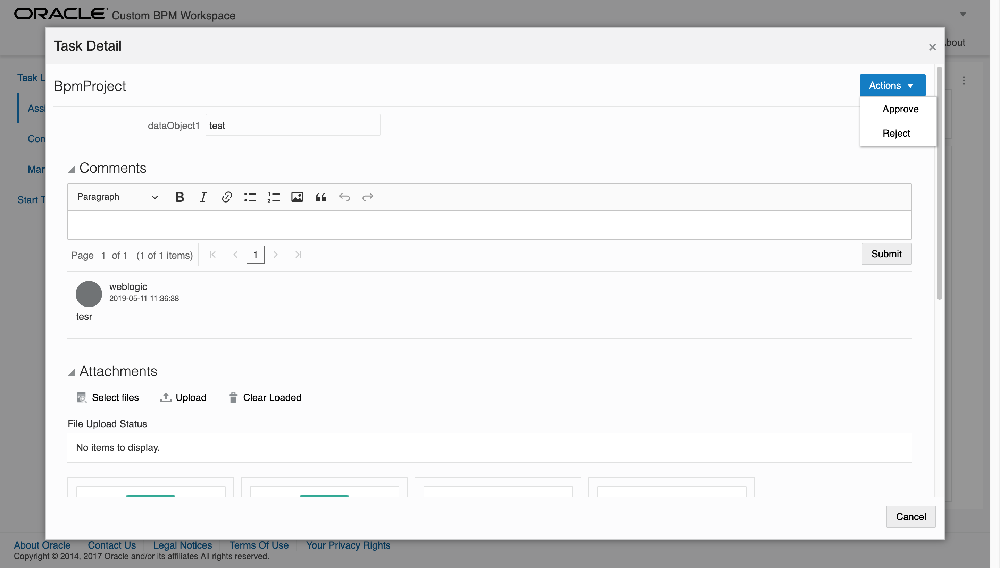
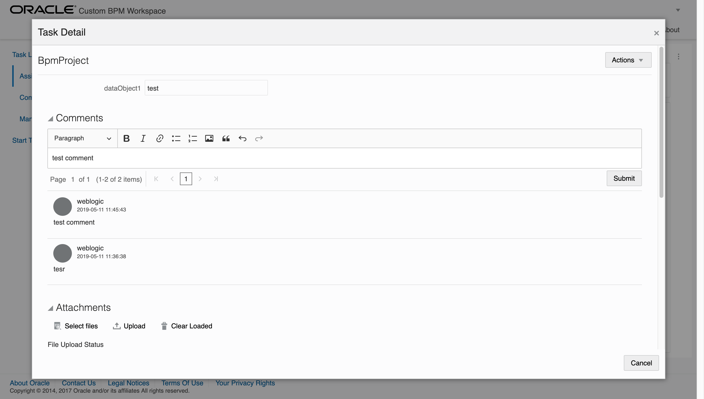
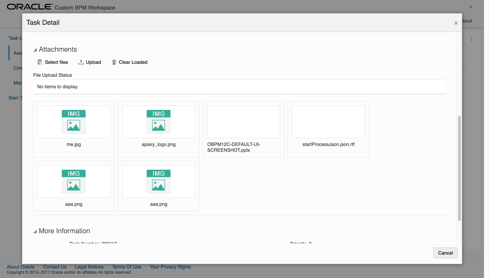
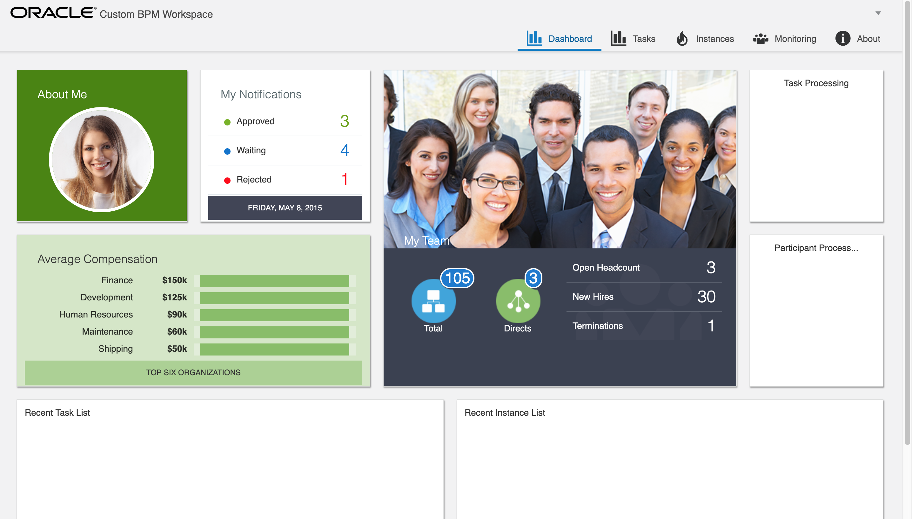

# Oracle Custom BPM 12c Workspace

This workspace is built with Oracle JET and BPM 12c (ver 12.2.1.3.0)
Currently Task features only have been implemented.

I have no plan to implement other features yet.

Oracle BPM Suite 12c 에서 제공하는 REST API를 활용해서 Oracle JET (Javascript Framework) Framework으로 개발한 Custom BPM Workspace 입니다.

현재 Task 쪽 기능만 구현이 되어 있습니다. (나머지 기능들은 아직 예정 없음)

# Features
* Login
* Assigned Task List
* Completed Task List
* Task Action
* Task Detail
* Task Comment
* Task Attachment

# This one is on which it is based
* Oracle JET 5.0.0
* Oracle BPM 12.2.1.3.0

# Things to be implementation
* Dashboard
* Task Status
* Instance List
* Instance Detail
* Process Tracking Diagram
* Process Monitoring
* Process & Instance Management

# Screentshots
Login

Assigned Task

Assigned Task List

Task Detail

Task Detail Extended

Task Detail Actions

Task Detail Comment

Task Detail Attachment

Dashboard (not implemented)
